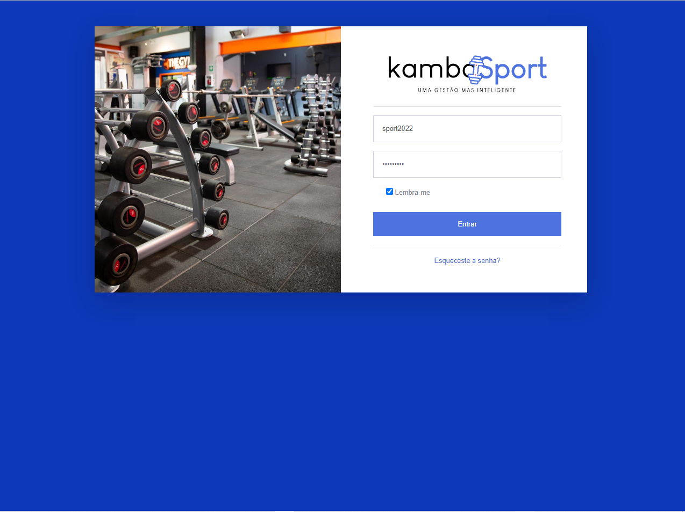
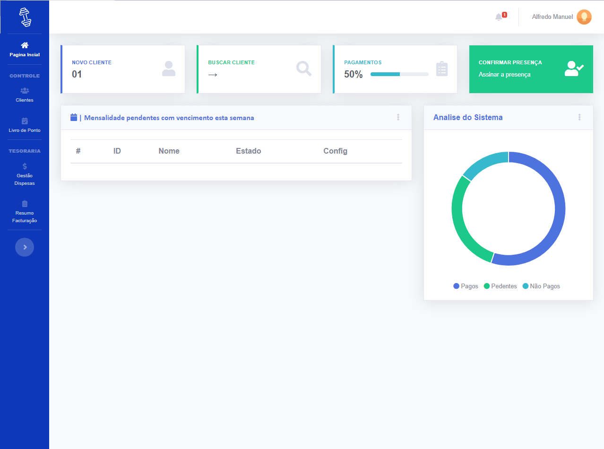
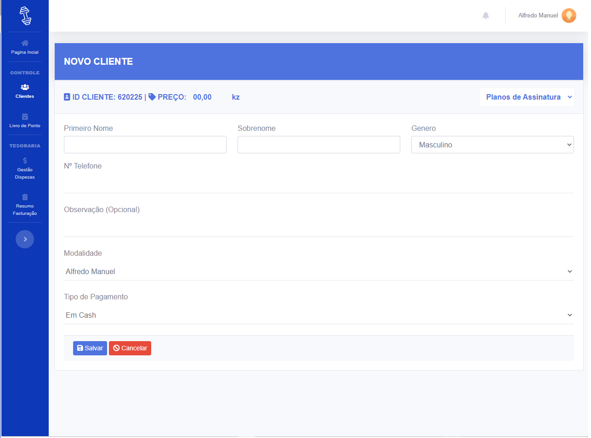
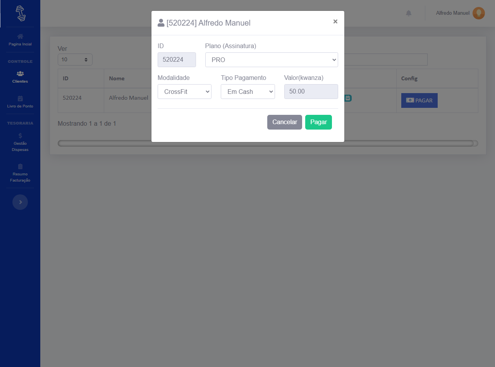

# Gym Management System

KambaSport is a gym management system focused on assisting with various tasks related to client management and employee control.

## KambaSport Features

- Employee Management
- Client Management
- Membership Management
- Financial Control

## Development Tools

- Back-end: PHP Language
- Front-end: jQuery, Bootstrap
- Database: MySQL

## KambaSport System Screenshots

## How to Use KambaSport

To use KambaSport, follow the instructions below:

1. Download the repository.
2. Install the necessary dependencies.
3. Configure the MySQL database.
4. Run the system on a local server.

## Contribution

Contributions are welcome! Feel free to open a pull request to suggest improvements, fix bugs, or add new features to KambaSport.

## License

This project is licensed under the [MIT License](LICENSE).

## Contact

- Twitter: [@Alfredo74765245](https://twitter.com/Alfredo74765245)
- Email: alfredomanuel127.0@gmail.com

Feel free to contact me if you have any questions, suggestions, or feedback about the project.
